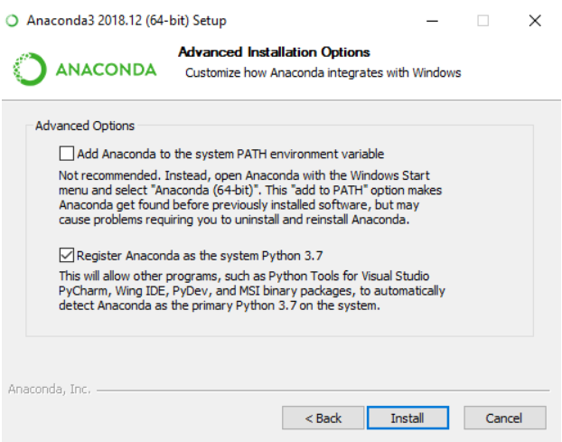
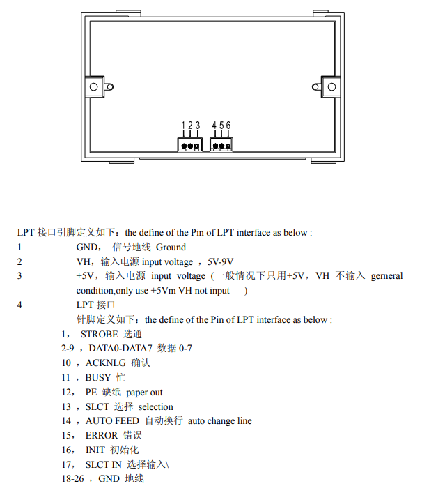

# Dependencies

## OpenCV on Ubuntu / Linux

### Install OpenCV

```command
sudo apt update
sudo apt install libopencv-dev python3-opencv
```

### Verify OpenCV

```command
python3 -c "import cv2; print(cv2.__version__)"
```

(Version 4.2.0 at time of writing)
[source](https://linuxize.com/post/how-to-install-opencv-on-ubuntu-20-04/)

## Python

### Install Python

```command
sudo apt-get install python
```

### Verify Python

```command
python --version
```

[source](https://www.makeuseof.com/install-python-ubuntu/)

## openCV on windows/conda

### install anaconda 

[source](https://www.anaconda.com/products/individual)

#### select just me


##### chose a install location


#### register anaconda with python 



### install opencv and python

#### start anaconda with admin rights


#### create environment

```bash
conda create — name opencv
activate opencv
```

#### install python & openCV

```bash
conda install python -y
conda install -c conda-forge opencv -y
```

## Raspberry Pi


[source](https://pi4j.com/1.4/pins/rpi-4b.html)

On the Pi, create a python file (e.g. `printer_communication.py`) which will be the link between the Pi and the Nucleo. The Nucleo is connected to the Pi via the USB port for simplicity. Then, in the file, add the following script:

```py
import time
import serial

ser = serial.Serial("/dev/ttyACM0", baudrate = 9600, parity=serial.PARITY_NONE, 
stopbits=serial.STOPBITS_ONE, bytesize=serial.EIGHTBITS, timeout=1)
counter=0

while 1:
        ser.write(b'write counter: %d \n'%(counter))
        time.sleep(1)
        counter +=1
        readedtext = ser.readline()
        print(readedtext)

```

Check which USB port is in use:

```bash
dmesg | grep "tty"
```

Update the "ACM0" to the port in use (obtained from the command above).

No other pins should be connected on the Pi for communication with the Nucleo. Now data from the `printer_communication` file is written to the serial port specified above and will read the data received from the Nucleo and print this to the terminal. In this case, the data written to the Nucleo will be sent to the printer, and written back to the Pi (this gives a digital view of what has been printed, but this can be changed if desired).

## Thermal printer

### Background info

Baud rate: 19200

[datasheet](https://cdn-shop.adafruit.com/datasheets/A2-user+manual.pdf)



### Library

import library: in empty repo (niet in git repo):

[Library source](https://os.mbed.com/components/Adafruit-Thermal-Printer/)

```commands
conda activate mbed
mbed import https://os.mbed.com/users/aross34/code/Thermal_HelloWorld/
```

OR

Download a zip file and place the files in a source folder with the rest of the code for the thermal printer.

### Printer setup via Nucleo

Connect the RX pin from the printer with pin D8 on the Nucleo, the TX pin with D2 on the Nucleo and the GND pin with a GND on the Nucleo. Power for the printer is best supplied via external power supply, not connected via the Nucleo or Pi. 5V and GND is needed for the power supply.

To program the printer to print the data received from the Nucleo (which has been received from the file on the Pi which links the devices):

```commands
conda activate mbed
mbed new .
mbed toolchain GCC_ARM
mbed target NUCLEO_L476RG
mbed compile -f
```

Once the Nucleo has been flashed, no further actions should be taken, except change the USB connection from the PC to the Pi (and make sure the connected port is the same as specified in the `printer_communication file`). The rest goes via the input provided by the Pi.
The [main.cpp file](./thermal-printer-updated-own-version/main.cpp) contains the necessary commands to get the received characters, puts them into the buffer until a new line is detected, then prints the buffer and resets the buffer so new data can be read and printed again.
